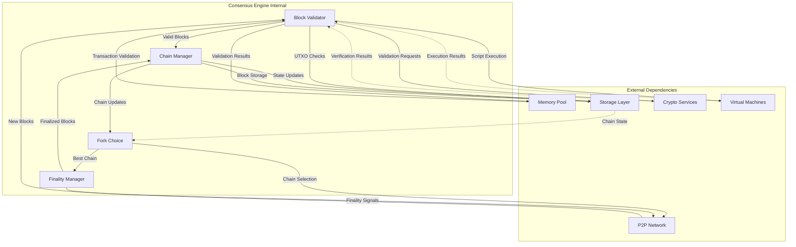
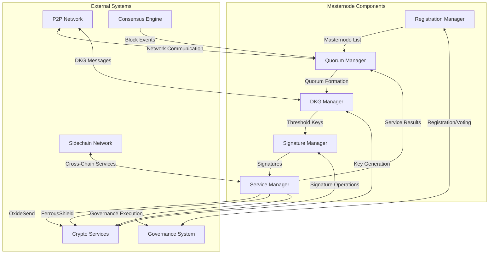
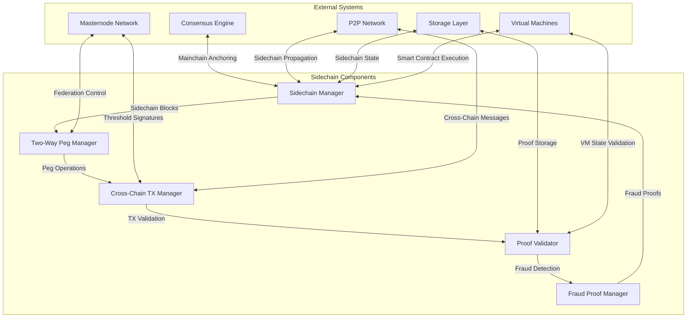
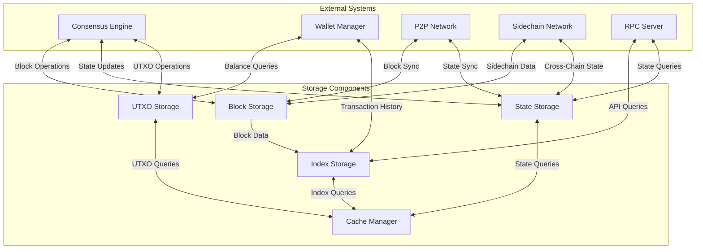
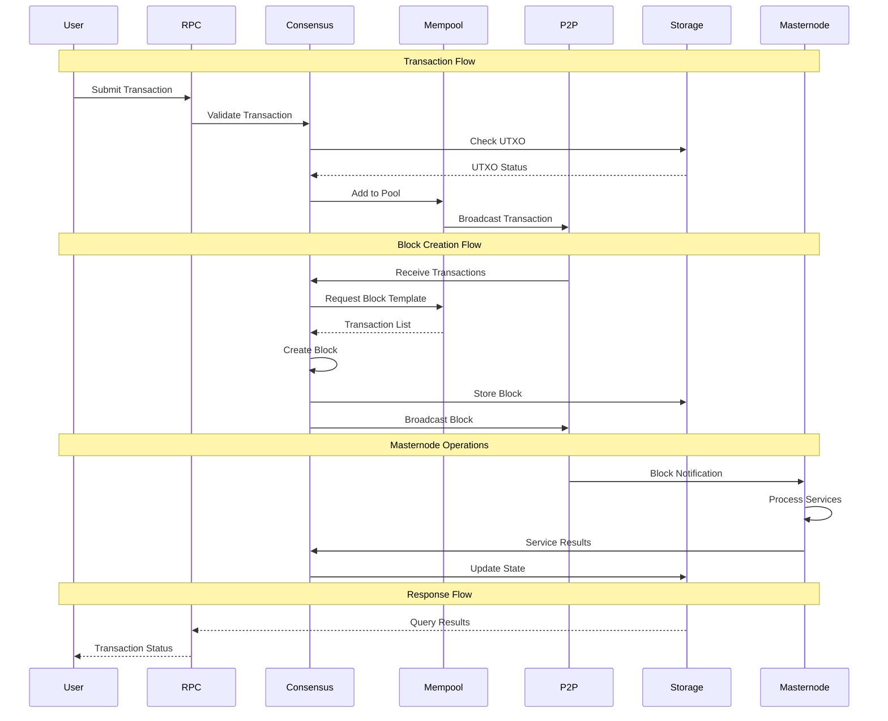
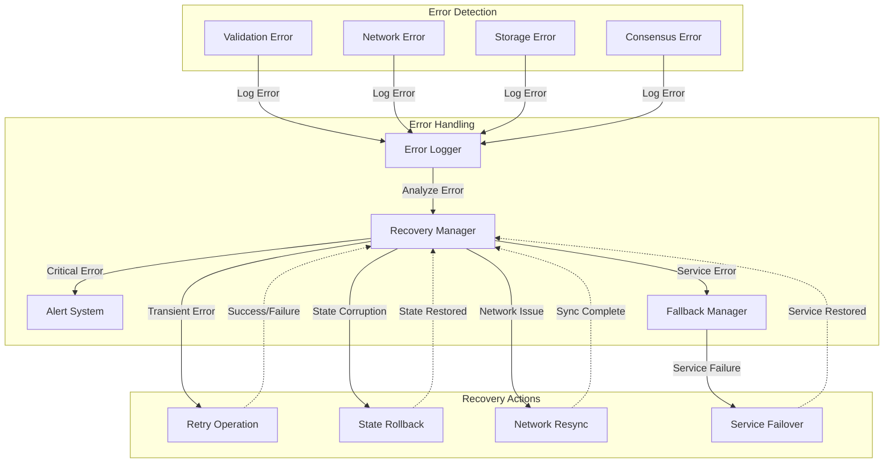

# Rusty Coin Component Interactions

This document details the interactions between different components in the Rusty Coin system.

## Core Component Interaction Map

```mermaid
graph TB
    subgraph "External Interfaces"
        CLI[CLI Interface]
        RPC[RPC Server]
        REST[REST API]
    end
    
    subgraph "Core Engine"
        CONSENSUS[Consensus Engine]
        MEMPOOL[Memory Pool]
        WALLET[Wallet Manager]
        GOVERNANCE[Governance System]
    end
    
    subgraph "Network Layer"
        P2P[P2P Network]
        MASTERNODE[Masternode Network]
        SIDECHAIN[Sidechain Network]
    end
    
    subgraph "Storage Systems"
        BLOCKCHAIN[Blockchain Storage]
        STATE[State Manager]
        UTXO[UTXO Database]
        INDEX[Block Index]
    end
    
    subgraph "Cryptographic Services"
        BLS[BLS Signatures]
        DKG[Distributed Key Generation]
        MERKLE[Merkle Tree Operations]
        HASH[Hash Functions]
    end
    
    subgraph "Virtual Machines"
        FERRIS[FerrisScript VM]
        EVM[Ethereum VM]
        WASM[WebAssembly VM]
        UTXOVM[UTXO VM]
    end
    
    %% External Interface Connections
    CLI -.->|Commands| RPC
    REST -.->|HTTP Requests| RPC
    RPC -->|API Calls| CONSENSUS
    RPC -->|API Calls| WALLET
    RPC -->|API Calls| GOVERNANCE
    
    %% Core Engine Interactions
    CONSENSUS <-->|Block Validation| MEMPOOL
    CONSENSUS <-->|State Updates| STATE
    CONSENSUS <-->|Chain Rules| GOVERNANCE
    WALLET <-->|Transaction Creation| MEMPOOL
    WALLET <-->|Balance Queries| UTXO
    GOVERNANCE <-->|Parameter Changes| CONSENSUS
    
    %% Network Layer Interactions
    P2P <-->|Block/TX Propagation| CONSENSUS
    P2P <-->|Peer Discovery| MASTERNODE
    MASTERNODE <-->|Quorum Operations| GOVERNANCE
    MASTERNODE <-->|Threshold Signatures| BLS
    SIDECHAIN <-->|Cross-Chain TX| CONSENSUS
    SIDECHAIN <-->|Federation Control| MASTERNODE
    
    %% Storage System Interactions
    CONSENSUS -->|Block Storage| BLOCKCHAIN
    CONSENSUS <-->|State Management| STATE
    STATE <-->|UTXO Operations| UTXO
    BLOCKCHAIN -->|Block Indexing| INDEX
    STATE -->|Merkle Proofs| MERKLE
    
    %% Cryptographic Service Interactions
    CONSENSUS -->|Block Hashing| HASH
    CONSENSUS -->|Merkle Roots| MERKLE
    MASTERNODE <-->|Key Generation| DKG
    MASTERNODE <-->|Signatures| BLS
    SIDECHAIN -->|Proof Validation| MERKLE
    SIDECHAIN -->|Federation Sigs| BLS
    
    %% Virtual Machine Interactions
    CONSENSUS -->|Script Execution| FERRIS
    SIDECHAIN -->|Smart Contracts| EVM
    SIDECHAIN -->|WASM Contracts| WASM
    SIDECHAIN -->|UTXO Scripts| UTXOVM
    
    classDef external fill:#e1f5fe,stroke:#01579b
    classDef core fill:#f3e5f5,stroke:#4a148c
    classDef network fill:#e8f5e8,stroke:#1b5e20
    classDef storage fill:#fff3e0,stroke:#e65100
    classDef crypto fill:#fce4ec,stroke:#880e4f
    classDef vm fill:#f1f8e9,stroke:#33691e
    
    class CLI,RPC,REST external
    class CONSENSUS,MEMPOOL,WALLET,GOVERNANCE core
    class P2P,MASTERNODE,SIDECHAIN network
    class BLOCKCHAIN,STATE,UTXO,INDEX storage
    class BLS,DKG,MERKLE,HASH crypto
    class FERRIS,EVM,WASM,UTXOVM vm
```

## Consensus Engine Detailed Interactions

## Masternode Network Interactions

## Sidechain Network Interactions

## Storage Layer Interactions

## Data Flow Between Components

## Error Handling and Recovery Flows

These component interaction diagrams provide a detailed view of how the various parts of the Rusty Coin system work together to provide a robust and scalable blockchain platform.
