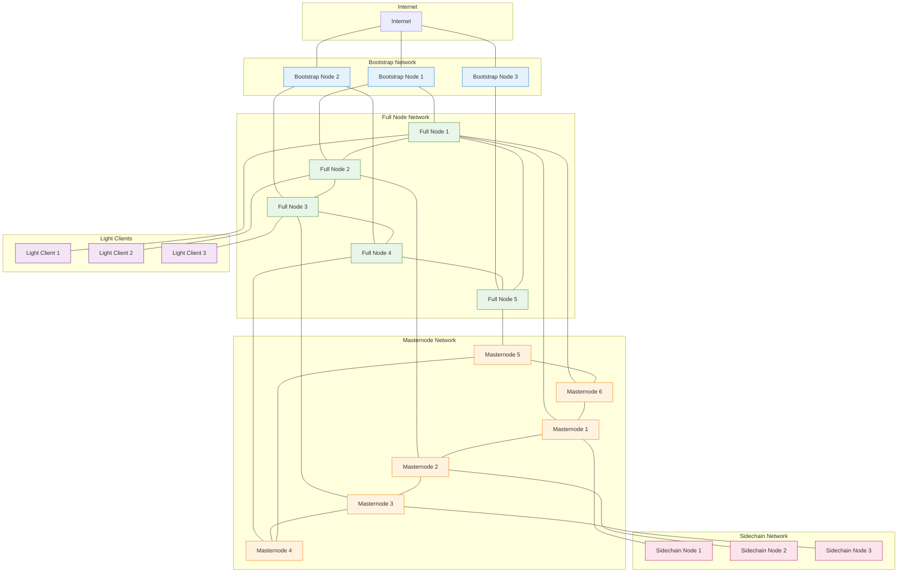
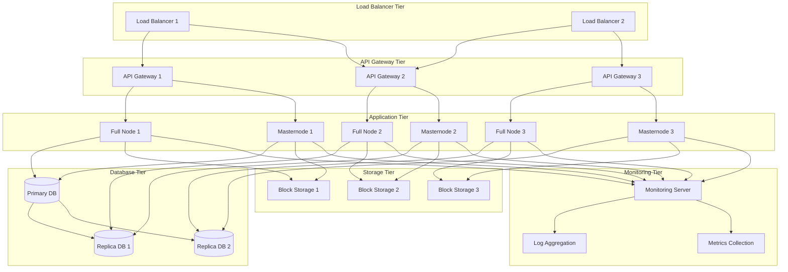
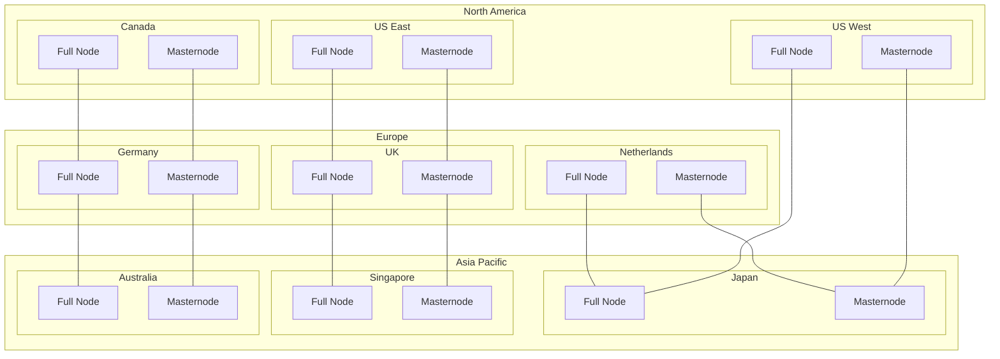
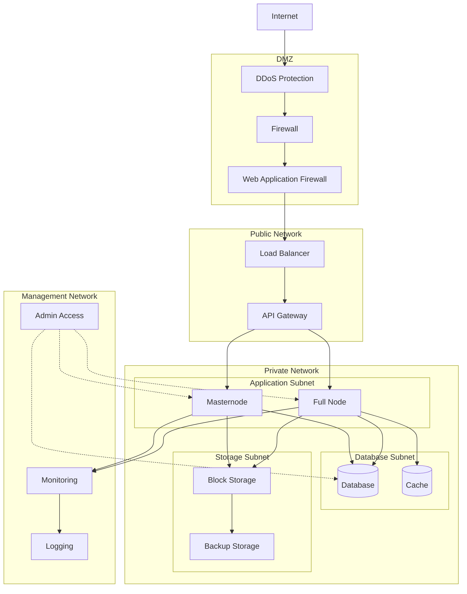
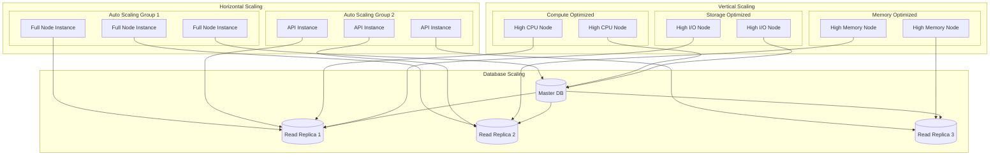
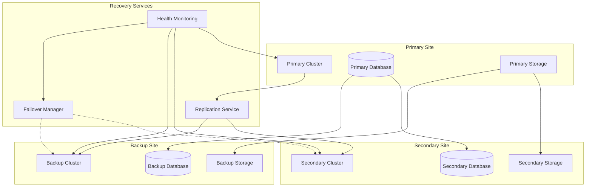
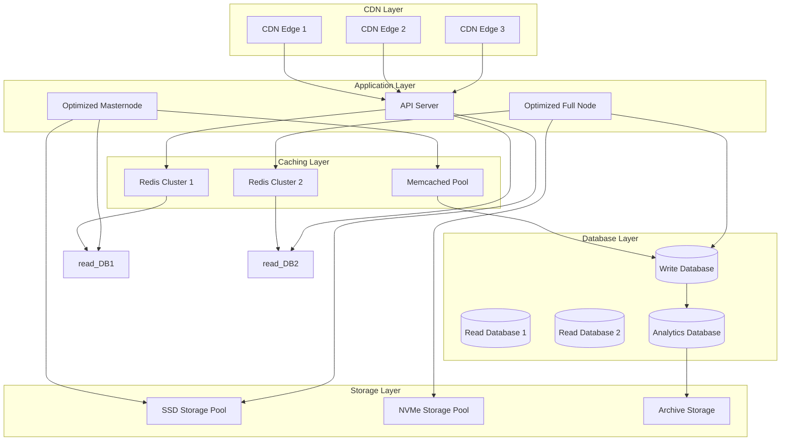

# Rusty Coin Network Topology and Deployment

This document describes the network topology, deployment architectures, and infrastructure requirements for the Rusty Coin system.

## Network Topology Overview

## Node Types and Responsibilities

### Bootstrap Nodes
- **Purpose**: Initial peer discovery and network entry point
- **Requirements**: High availability, stable IP addresses
- **Responsibilities**:
  - Maintain peer lists
  - Provide initial blockchain headers
  - Route new nodes to appropriate peers

### Full Nodes
- **Purpose**: Complete blockchain validation and storage
- **Requirements**: Full blockchain storage, high bandwidth
- **Responsibilities**:
  - Validate all blocks and transactions
  - Maintain complete UTXO set
  - Serve data to light clients
  - Participate in block propagation

### Masternodes
- **Purpose**: Special services and governance participation
- **Requirements**: Collateral stake, high availability, enhanced security
- **Responsibilities**:
  - Form quorums for threshold signatures
  - Provide OxideSend and FerrousShield services
  - Participate in governance voting
  - Validate cross-chain transactions

### Sidechain Nodes
- **Purpose**: Sidechain operation and cross-chain communication
- **Requirements**: Sidechain-specific storage, federation participation
- **Responsibilities**:
  - Validate sidechain blocks
  - Process cross-chain transactions
  - Maintain sidechain state
  - Generate fraud proofs

### Light Clients
- **Purpose**: Lightweight blockchain interaction
- **Requirements**: Minimal storage, SPV validation
- **Responsibilities**:
  - Verify block headers
  - Request transaction proofs
  - Submit transactions
  - Query balances

## Production Deployment Architecture

## Geographic Distribution

## Network Security Architecture

## Scalability Architecture

## Disaster Recovery Architecture

## Performance Optimization Topology

This network topology and deployment architecture provides a robust, scalable, and secure foundation for the Rusty Coin blockchain network, with considerations for performance, disaster recovery, and global distribution.
