# Rusty Coin Protocol Flows

This document details the key protocol flows and interactions within the Rusty Coin system.

## Block Production and Validation Flow

## Masternode Quorum Formation Flow

## Governance Proposal Flow

## Sidechain Two-Way Peg Flow

## Cross-Chain Transaction Flow

## Fraud Proof Challenge Flow

## P2P Network Synchronization Flow

## Transaction Lifecycle Flow

## Masternode Service Flow

```mermaid
graph TB
    subgraph "Service Request Flow"
        A[Service Request] --> B{Quorum Available?}
        B -->|Yes| C[Select Quorum]
        B -->|No| D[Form New Quorum]
        
        C --> E[Distribute Request]
        D --> F[DKG Process]
        F --> C
        
        E --> G[Process Request]
        G --> H[Generate Partial Signatures]
        H --> I[Combine Signatures]
        I --> J[Return Result]
    end
    
    subgraph "Quorum Management"
        K[Monitor Quorum Health]
        K --> L{Quorum Valid?}
        L -->|Yes| M[Continue Service]
        L -->|No| N[Rotate Quorum]
        N --> F
        M --> K
    end
    
    subgraph "Service Types"
        O[OxideSend Mixing]
        P[FerrousShield Privacy]
        Q[Cross-Chain Validation]
        R[Governance Execution]
    end
    
    J --> O
    J --> P
    J --> Q
    J --> R
```

These protocol flows provide a comprehensive view of how the various components of the Rusty Coin system interact to provide secure, scalable, and efficient blockchain operations.
