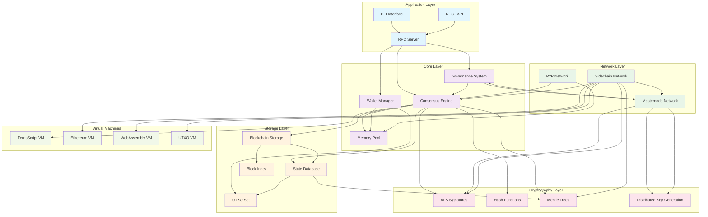
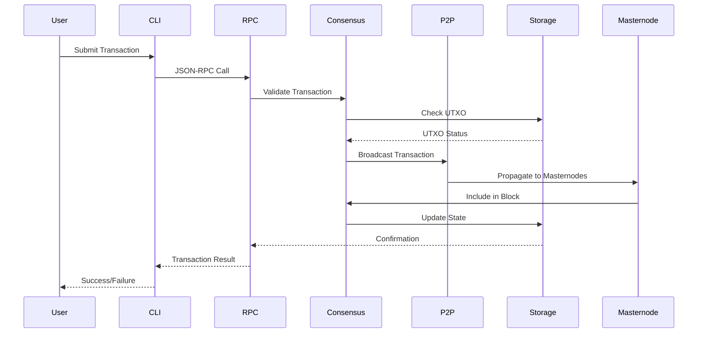
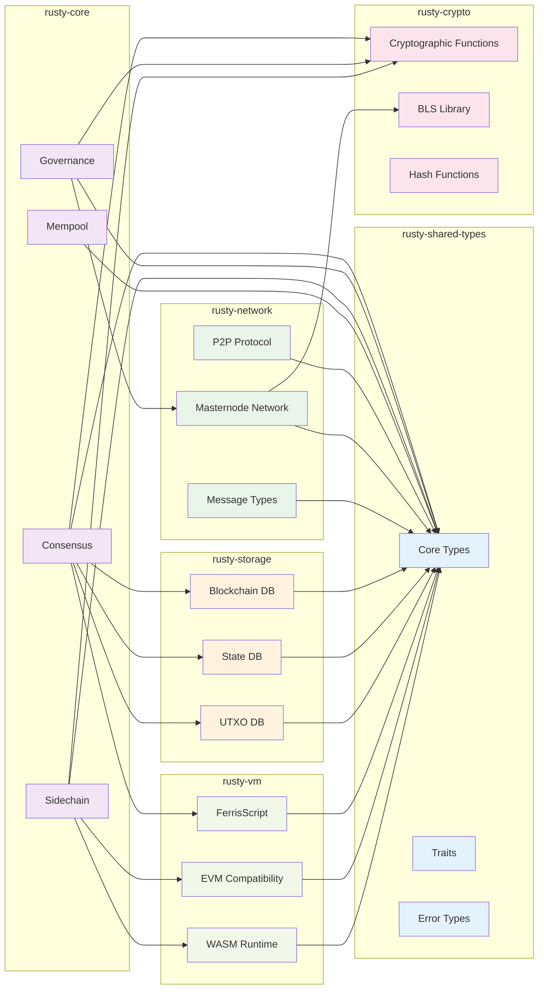
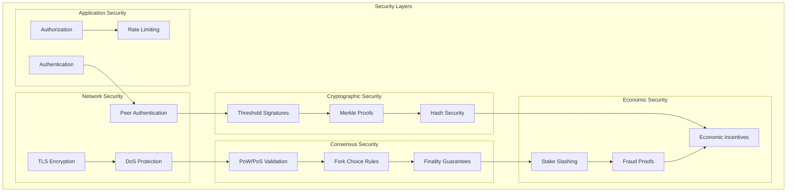
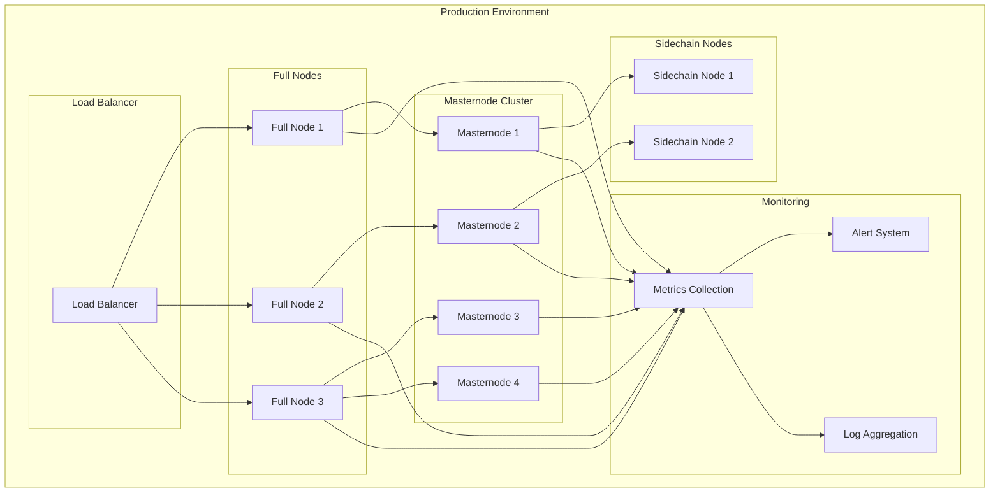

# Rusty Coin System Architecture Overview

This document provides a comprehensive overview of the Rusty Coin system architecture, including component interactions, data flow, and protocol relationships.

## High-Level System Architecture

## Component Responsibilities

### Application Layer
- **CLI Interface**: Command-line interface for node operations and wallet management
- **RPC Server**: JSON-RPC interface for external applications and services
- **REST API**: HTTP REST API for web applications and light clients

### Core Layer
- **Consensus Engine**: Block validation, chain selection, and consensus rule enforcement
- **Governance System**: Proposal processing, voting, and parameter change execution
- **Memory Pool**: Transaction validation, fee estimation, and block template creation
- **Wallet Manager**: Key management, transaction creation, and balance tracking

### Network Layer
- **P2P Network**: Peer discovery, block/transaction propagation, and network synchronization
- **Masternode Network**: Quorum formation, threshold signatures, and special services
- **Sidechain Network**: Cross-chain communication and sidechain block propagation

### Storage Layer
- **Blockchain Storage**: Persistent block and transaction storage with indexing
- **State Database**: Current blockchain state with Merkle Patricia Trie structure
- **UTXO Set**: Unspent transaction output tracking and validation
- **Block Index**: Fast block lookup and chain navigation

### Cryptography Layer
- **BLS Signatures**: Threshold signatures for masternode operations
- **Hash Functions**: BLAKE3 and SHA-256 for various cryptographic operations
- **Merkle Trees**: Block transaction trees and state proof generation
- **Distributed Key Generation**: Secure threshold key generation for masternodes

### Virtual Machines
- **FerrisScript VM**: Native scripting engine for transaction validation
- **Ethereum VM**: EVM compatibility for smart contracts on sidechains
- **WebAssembly VM**: High-performance contract execution environment
- **UTXO VM**: Custom UTXO-based virtual machine for specialized operations

## Data Flow Architecture

## Module Dependencies

## Security Architecture

## Performance Considerations

### Scalability Metrics
- **Transaction Throughput**: 1000+ TPS with sidechain scaling
- **Block Time**: 2.5 minutes average
- **Confirmation Time**: 6 blocks (15 minutes) for finality
- **Storage Growth**: ~50GB/year at full capacity

### Optimization Strategies
- **Parallel Validation**: Multi-threaded transaction validation
- **Compact Blocks**: Reduced bandwidth usage for block propagation
- **State Pruning**: Historical state cleanup for storage efficiency
- **Sidechain Scaling**: Horizontal scaling through specialized sidechains

### Resource Requirements
- **Memory**: 4GB minimum, 8GB recommended
- **Storage**: 100GB minimum, SSD recommended
- **Network**: 10Mbps minimum, 100Mbps recommended
- **CPU**: 4 cores minimum, 8 cores recommended

## Deployment Architecture

This architecture provides a robust, scalable, and secure foundation for the Rusty Coin blockchain system, with clear separation of concerns and well-defined interfaces between components.
