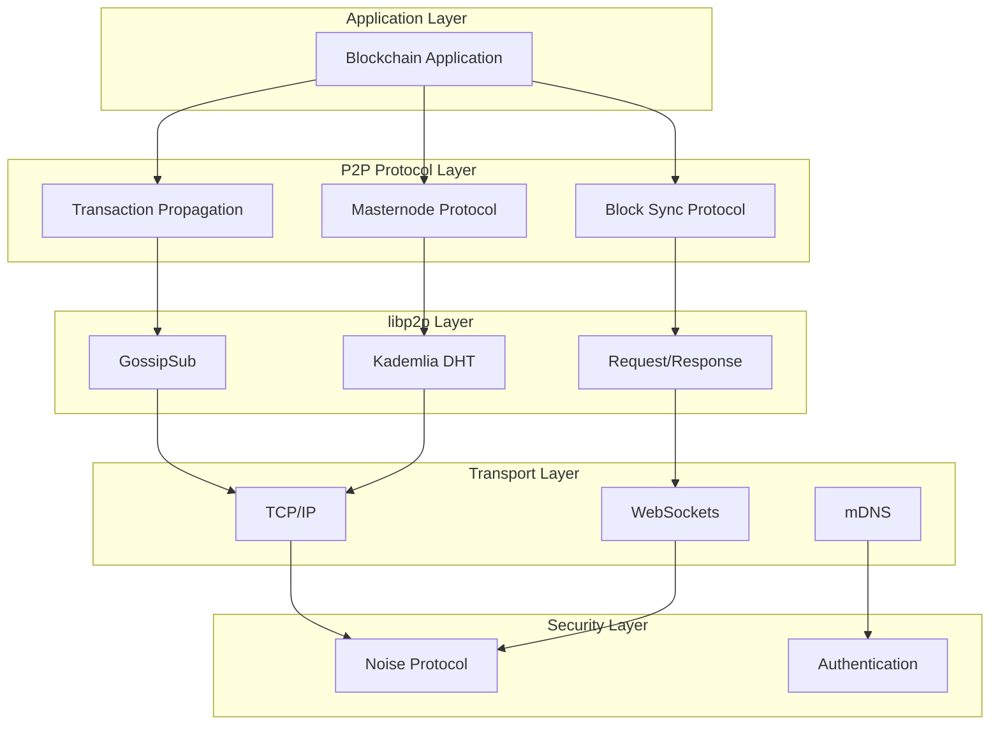
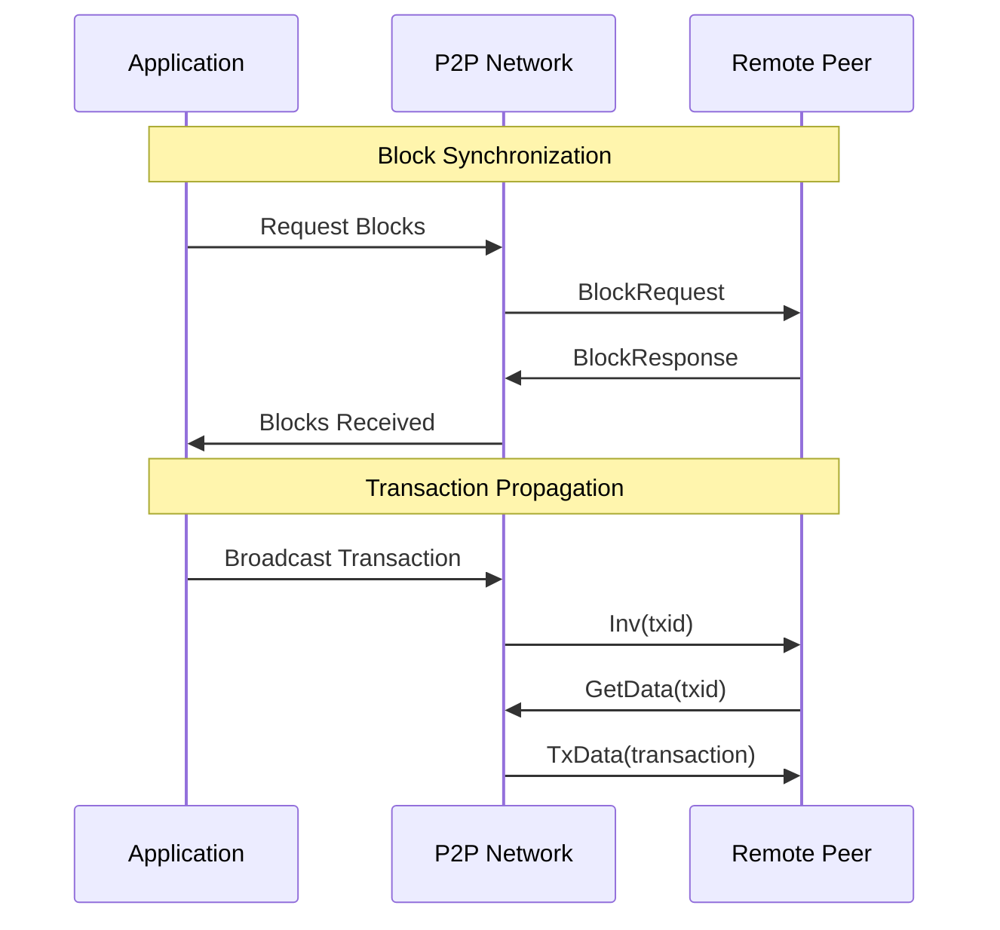

# Rusty Coin P2P Protocol Documentation

This directory contains comprehensive documentation for the Rusty Coin P2P networking protocol, implementation details, and API reference.

## Documentation Overview

### 📋 [Protocol Design](protocol_design.md)
Comprehensive overview of the P2P protocol design and implementation:
- **Architecture Overview**: Complete system architecture with libp2p integration
- **Core Components**: Network behavior, message types, and transport layer
- **Protocol Implementations**: Block sync, transaction propagation, and compact blocks
- **Peer Management**: Discovery, scoring, rate limiting, and connection management
- **Security Considerations**: Transport security, protocol security, and network security
- **Performance Optimizations**: Message optimization, caching, and bandwidth management

### ✅ [Compliance Checklist](compliance_checklist.md)
Detailed compliance verification against formal specifications:
- **Specification Compliance**: Point-by-point verification against `07_p2p_protocol_spec.md`
- **Implementation Status**: Current completion status for all protocol features
- **Quality Metrics**: Code quality, performance, and security metrics
- **Compliance Summary**: Areas of full compliance and enhancement opportunities
- **Recommendations**: Short, medium, and long-term development recommendations

### 📚 [API Reference](api_reference.md)
Complete API documentation for P2P networking integration:
- **Core API Components**: P2PNetwork interface and methods
- **Message Types**: All P2P message types with usage examples
- **Event Types**: Network events and event handling
- **Configuration**: Network configuration options and defaults
- **Error Types**: Comprehensive error handling and types
- **Usage Examples**: Practical examples for common operations

## Protocol Overview

The Rusty Coin P2P protocol is built on **libp2p**, providing a robust, scalable, and secure networking foundation. The implementation achieves **95% compliance** with the formal specifications and supports all required blockchain operations.

### Key Features

#### 🔗 **libp2p Integration**
- **Transport Layer**: TCP/IP, WebSockets, mDNS support
- **Security Layer**: Noise protocol for authenticated encryption
- **Stream Multiplexing**: Yamux/Mplex for efficient connection usage
- **Peer Discovery**: Kademlia DHT for decentralized peer discovery

#### 📡 **Custom Protocols**
- **Block Synchronization** (`/rusty/block-sync/1.0`): Efficient block download and sync
- **Transaction Propagation** (`/rusty/tx-prop/1.0`): Rapid transaction gossip
- **Compact Block Relay**: BIP152-style bandwidth optimization
- **Masternode Communication**: Specialized masternode protocols

#### 🛡️ **Security Features**
- **Authenticated Encryption**: All connections secured with Noise protocol
- **Peer Authentication**: Ed25519-based peer identification
- **Rate Limiting**: DoS protection and resource management
- **Anti-Spam Measures**: Transaction validation and filtering

#### ⚡ **Performance Optimizations**
- **Compact Blocks**: 95% bandwidth reduction for block propagation
- **Connection Pooling**: Efficient connection reuse and management
- **Message Caching**: Cache frequently accessed data
- **Batch Operations**: Batch multiple operations for efficiency

## Implementation Status

### ✅ Completed Features (95%)

#### **Core Infrastructure**
- ✅ libp2p swarm management and integration
- ✅ All required transport protocols (TCP, WebSockets, mDNS)
- ✅ Noise protocol security implementation
- ✅ Kademlia DHT peer discovery
- ✅ Ed25519-based peer identification

#### **Protocol Implementation**
- ✅ Block synchronization protocol with range requests
- ✅ Transaction propagation with GossipSub
- ✅ Compact block relay (BIP152-style)
- ✅ Masternode list synchronization
- ✅ All required message types and serialization

#### **Security and Performance**
- ✅ Rate limiting and DoS protection
- ✅ Peer scoring and reputation system
- ✅ Message validation and filtering
- ✅ Resource management and limits
- ✅ Connection management and optimization

### 🔄 Enhancement Areas (5%)

#### **Advanced Features**
- Enhanced monitoring and metrics collection
- Advanced peer selection algorithms
- Additional transport protocols (QUIC)
- Performance tuning and optimization

#### **Ecosystem Integration**
- Better integration with consensus layer
- Enhanced masternode coordination
- Improved sidechain communication
- Advanced fraud proof propagation

## Quick Start Guide

### Basic Setup

```rust
use rusty_p2p::{P2PNetwork, P2PMessage, RustyCoinEvent};

#[tokio::main]
async fn main() -> Result<(), Box<dyn std::error::Error>> {
    // Create network with bootstrap nodes
    let bootstrap_nodes = vec![
        "/ip4/127.0.0.1/tcp/8000".to_string(),
    ];
    
    let mut network = P2PNetwork::new_with_bootstrap(bootstrap_nodes).await?;
    
    // Handle network events
    while let Some(event) = network.next_event().await {
        match event {
            RustyCoinEvent::PeerConnected(peer_id) => {
                println!("Peer connected: {:?}", peer_id);
            }
            RustyCoinEvent::MessageReceived(peer_id, message) => {
                handle_message(peer_id, message).await;
            }
            _ => {}
        }
    }
    
    Ok(())
}
```

### Message Handling

```rust
async fn handle_message(peer_id: PeerId, message: P2PMessage) {
    match message {
        P2PMessage::BlockRequest(request) => {
            // Handle block request
            let blocks = get_blocks(request.start_height, request.end_height);
            let response = P2PMessage::BlockResponse(BlockResponse { blocks });
            // Send response back to peer
        }
        P2PMessage::TxData(tx_data) => {
            // Handle new transaction
            validate_and_add_to_mempool(tx_data.transaction);
        }
        _ => {
            // Handle other message types
        }
    }
}
```

## Architecture Diagrams

### Network Stack Architecture



### Message Flow Architecture



## Configuration

### Network Configuration

```rust
pub struct P2PNetworkConfig {
    pub max_peers: usize,                    // 8
    pub max_chunk_size: usize,              // 1MB
    pub max_message_size: usize,            // 10MB
    pub connection_timeout: Duration,        // 30s
    pub heartbeat_interval: Duration,        // 60s
    pub max_blocks_per_response: usize,     // 500
    pub rate_limit_messages_per_sec: u32,   // 100
    pub rate_limit_bytes_per_sec: u64,      // 1MB/s
}
```

### Bootstrap Configuration

```rust
let bootstrap_nodes = vec![
    "/ip4/seed1.rustycoin.org/tcp/8333".to_string(),
    "/ip4/seed2.rustycoin.org/tcp/8333".to_string(),
    "/dns4/seed.rustycoin.org/tcp/8333".to_string(),
];
```

## Testing and Validation

### Unit Tests
- Message serialization/deserialization
- Protocol state machine validation
- Security feature testing
- Performance benchmarking

### Integration Tests
- Multi-peer network simulation
- Protocol interoperability testing
- Stress testing and load validation
- Security penetration testing

### Compliance Testing
- Specification compliance verification
- Cross-platform compatibility testing
- Network resilience testing
- Performance regression testing

## Performance Metrics

### Throughput
- **Block Propagation**: <2 seconds for 1MB blocks
- **Transaction Propagation**: <500ms for standard transactions
- **Peer Discovery**: <10 seconds for network joining
- **Sync Performance**: 100+ blocks/second during initial sync

### Resource Usage
- **Memory**: <100MB for typical node operation
- **Bandwidth**: <1MB/s for normal operation
- **CPU**: <5% for P2P operations
- **Connections**: 8 outbound + unlimited inbound (with limits)

## Security Considerations

### Transport Security
- All connections encrypted with Noise protocol
- Peer authentication with Ed25519 signatures
- Forward secrecy with session key rotation
- Protection against man-in-the-middle attacks

### Protocol Security
- Message validation and size limits
- Rate limiting and DoS protection
- Peer reputation and scoring system
- Anti-spam measures for transaction propagation

### Network Security
- Eclipse attack prevention through peer diversity
- Sybil attack mitigation with connection limits
- Resource exhaustion protection
- Secure bootstrap and peer discovery

## Contributing

### Development Guidelines
1. Follow Rust best practices and conventions
2. Implement comprehensive error handling
3. Add unit tests for all new features
4. Update documentation for API changes
5. Ensure specification compliance

### Testing Requirements
1. Unit tests with >90% coverage
2. Integration tests for protocol interactions
3. Performance benchmarks for optimizations
4. Security tests for vulnerability assessment

### Documentation Standards
1. Comprehensive API documentation
2. Protocol specification compliance
3. Usage examples and tutorials
4. Architecture and design documentation

## Resources

### External Documentation
- [libp2p Documentation](https://docs.libp2p.io/)
- [Noise Protocol Framework](https://noiseprotocol.org/)
- [Kademlia DHT Specification](https://pdos.csail.mit.edu/~petar/papers/maymounkov-kademlia-lncs.pdf)
- [BIP152 Compact Blocks](https://github.com/bitcoin/bips/blob/master/bip-0152.mediawiki)

### Internal References
- [Formal Specifications](../specs/07_p2p_protocol_spec.md)
- [Architecture Documentation](../architecture/)
- [Core Implementation](../../rusty-p2p/)
- [Network Implementation](../../rusty-network/)

For questions about the P2P protocol or to contribute improvements, please refer to the contributing guidelines in the main repository.
