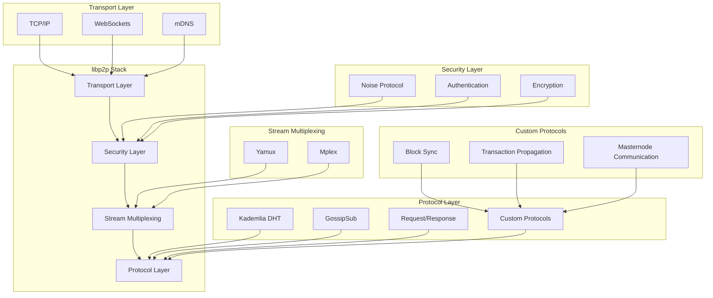
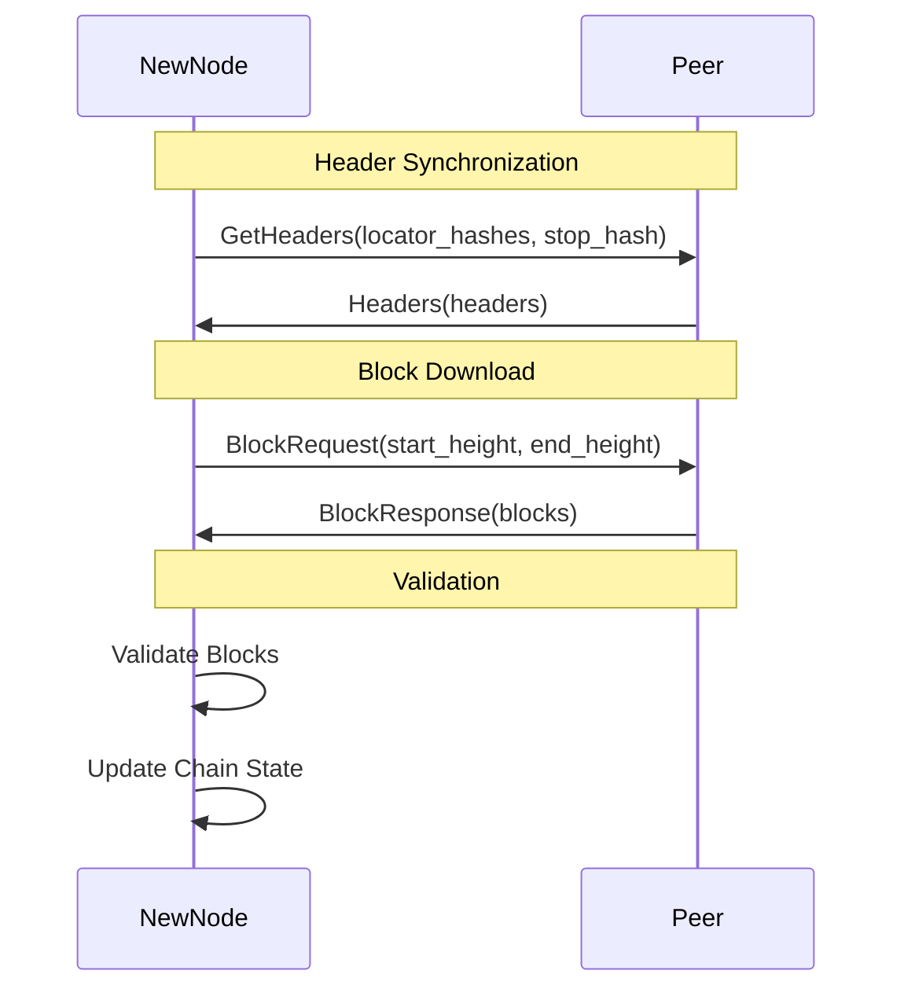
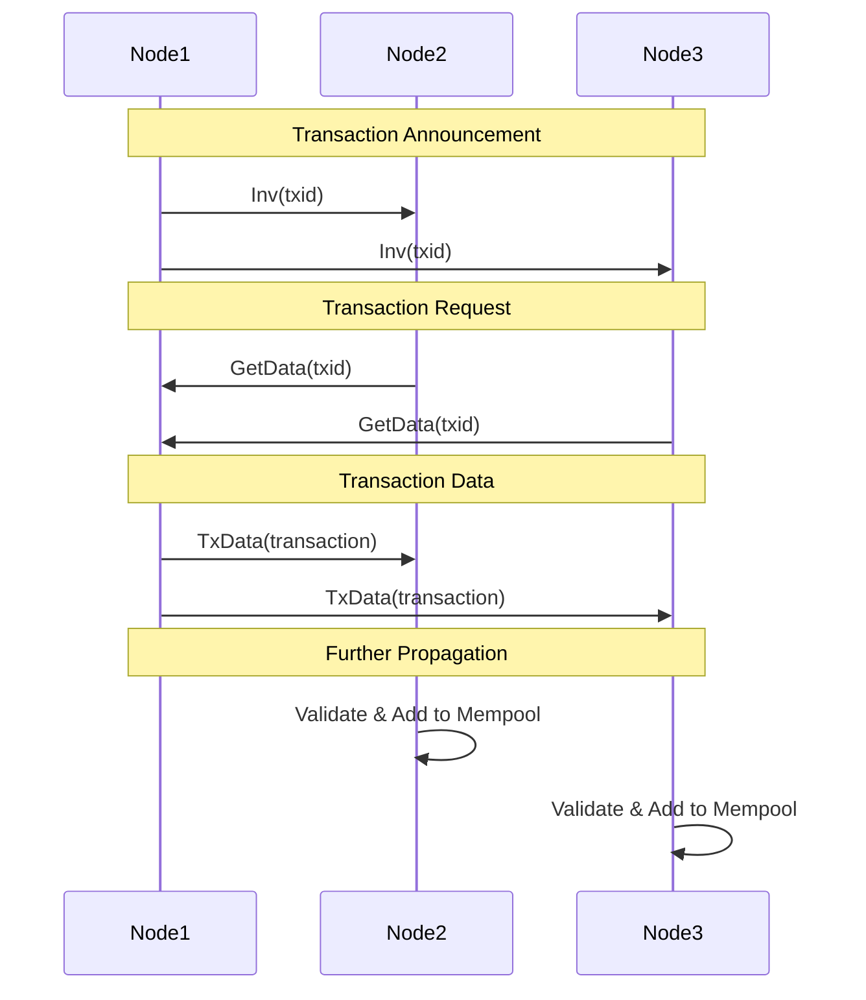

# Rusty Coin P2P Protocol Design

This document provides a comprehensive overview of the Rusty Coin P2P protocol design, implementation details, and compliance with the formal specifications.

## Overview

The Rusty Coin P2P network is built on libp2p, providing a robust, scalable, and secure communication layer for the blockchain network. The implementation follows the specifications outlined in `07_p2p_protocol_spec.md` and provides efficient block propagation, transaction gossiping, and peer discovery.

## Architecture Overview



## Core Components

### 1. Network Behavior

The `RustyCoinBehaviour` struct implements the core network behavior:

```rust
#[derive(NetworkBehaviour)]
pub struct RustyCoinBehaviour {
    pub floodsub: Floodsub,
    pub mdns: Mdns,
    pub kademlia: Kademlia<MemoryStore>,
    pub gossipsub: Gossipsub,
    pub request_response: RequestResponse<RustyCoinExchangeCodec>,
    pub event_sender: tokio::sync::mpsc::Sender<RustyCoinEvent>,
}
```

**Components:**
- **Floodsub**: Simple flooding-based pub/sub for basic message propagation
- **mDNS**: Local network peer discovery
- **Kademlia**: Distributed hash table for peer discovery and routing
- **GossipSub**: Efficient gossip-based message propagation
- **Request/Response**: Direct peer-to-peer request/response communication

### 2. Message Types

The P2P protocol defines comprehensive message types for all network operations:

```rust
#[derive(Debug, Serialize, Deserialize, Clone)]
pub enum P2PMessage {
    // Block synchronization
    BlockRequest(BlockRequest),
    BlockResponse(BlockResponse),
    GetHeaders(GetHeaders),
    Headers(Headers),
    
    // Transaction propagation
    Inv(Inv),
    TxData(TxData),
    
    // Compact blocks (BIP152-style)
    CompactBlock(CompactBlock),
    GetBlockTxs(GetBlockTxs),
    BlockTxs(BlockTxs),
    
    // Masternode network
    MasternodeListRequest(MasternodeListRequest),
    MasternodeListResponse(MasternodeListResponse),
    MasternodeUpdate(MasternodeUpdate),
    MasternodeListSync(MasternodeListSync),
    
    // Proof-of-Service
    PoSeResponse(PoSeResponse),
    
    // Chunked data transfer
    Chunk(Chunk),
}
```

### 3. Transport Layer

**Supported Transports:**
- **TCP/IP**: Primary transport for reliable communication (IPv4/IPv6)
- **WebSockets**: Browser compatibility and firewall traversal
- **mDNS**: Local area network peer discovery

**Security:**
- **Noise Protocol**: Authenticated encryption for all connections
- **Ed25519 Keys**: Peer identity and authentication
- **Stream Multiplexing**: Yamux/Mplex for efficient connection usage

## Protocol Implementations

### 1. Block Synchronization Protocol (`/rusty/block-sync/1.0`)

**Purpose**: Efficient block retrieval for initial sync and catch-up

**Message Flow:**


**Implementation Details:**
- **Range Requests**: Efficient batch block downloading
- **Header-First Sync**: Download headers before block bodies
- **Parallel Downloads**: Multiple concurrent block requests
- **Validation Pipeline**: Validate blocks as they arrive

### 2. Transaction Propagation Protocol (`/rusty/tx-prop/1.0`)

**Purpose**: Rapid transaction gossip across the network

**Message Flow:**


**Anti-Spam Measures:**
- **Validation Before Relay**: Only relay valid transactions
- **Rate Limiting**: Limit INV and TxData messages per peer
- **Fee Filtering**: Only relay transactions meeting fee requirements
- **Duplicate Detection**: Prevent duplicate transaction propagation

### 3. Compact Block Relay (BIP152-style)

**Purpose**: Bandwidth-efficient block propagation

**Components:**
- **Short Transaction IDs**: 6-byte transaction identifiers
- **Prefilled Transactions**: Important transactions included in full
- **Missing Transaction Requests**: Request only missing transactions

**Benefits:**
- **Reduced Bandwidth**: ~95% bandwidth reduction for block propagation
- **Faster Propagation**: Reduced latency for block relay
- **Mempool Utilization**: Leverage existing mempool contents

### 4. Masternode Network Protocol

**Purpose**: Specialized communication for masternode operations

**Message Types:**
- **MasternodeListRequest/Response**: Synchronize masternode lists
- **MasternodeUpdate**: Propagate masternode status changes
- **MasternodeListSync**: Incremental list synchronization

**Features:**
- **Incremental Updates**: Only sync changes, not full lists
- **Signature Verification**: All updates cryptographically signed
- **Version Control**: Protocol versioning for compatibility

## Peer Management

### 1. Peer Discovery

**Kademlia DHT:**
- **Routing Table**: k-buckets for efficient peer storage
- **Bootstrap Nodes**: Initial connection points
- **Peer Advertisement**: Advertise own address to network
- **Peer Lookup**: Find peers for specific operations

**mDNS Discovery:**
- **Local Network**: Discover peers on same LAN
- **Zero Configuration**: Automatic peer discovery
- **Development Support**: Useful for local testing

### 2. Peer Scoring and Rate Limiting

**Peer Scoring:**
```rust
pub struct PeerScore {
    pub connection_time: std::time::Instant,
    pub messages_sent: u64,
    pub messages_received: u64,
    pub bytes_sent: u64,
    pub bytes_received: u64,
    pub invalid_messages: u64,
    pub last_seen: std::time::Instant,
    pub reputation: i32,
}
```

**Rate Limiting:**
```rust
pub struct PeerRateLimiter {
    pub message_bucket: TokenBucket,
    pub byte_bucket: TokenBucket,
    pub last_refill: std::time::Instant,
}
```

**Benefits:**
- **DoS Protection**: Prevent resource exhaustion attacks
- **Quality Control**: Prioritize well-behaved peers
- **Resource Management**: Efficient bandwidth utilization

### 3. Connection Management

**Connection Limits:**
- **Maximum Peers**: 8 outbound + unlimited inbound (with limits)
- **Connection Diversity**: Geographic and network diversity
- **Persistent Connections**: Maintain stable peer set

**Connection Security:**
- **Noise Protocol**: All connections encrypted and authenticated
- **Peer Identity**: Ed25519-based peer identification
- **Connection Validation**: Verify peer capabilities

## Network Configuration

### 1. Default Configuration

```rust
pub struct P2PNetworkConfig {
    pub max_peers: usize,                    // 8
    pub max_chunk_size: usize,              // 1MB
    pub max_message_size: usize,            // 10MB
    pub connection_timeout: Duration,        // 30s
    pub heartbeat_interval: Duration,        // 60s
    pub max_blocks_per_response: usize,     // 500
    pub rate_limit_messages_per_sec: u32,   // 100
    pub rate_limit_bytes_per_sec: u64,      // 1MB
}
```

### 2. Bootstrap Configuration

**Bootstrap Nodes:**
- **Hardcoded Seeds**: Initial bootstrap nodes in client
- **DNS Seeds**: DNS-based seed node discovery
- **Dynamic Updates**: Update seed list via network consensus

**Bootstrap Process:**
1. Connect to bootstrap nodes
2. Join Kademlia DHT
3. Discover additional peers
4. Establish diverse peer connections

## Security Considerations

### 1. Transport Security

**Noise Protocol:**
- **Authenticated Encryption**: Confidentiality and integrity
- **Forward Secrecy**: Session key rotation
- **Peer Authentication**: Cryptographic peer identity

**Connection Security:**
- **TLS Support**: Optional TLS for WebSocket connections
- **Certificate Validation**: Proper certificate handling
- **Secure Defaults**: Secure configuration by default

### 2. Protocol Security

**Message Validation:**
- **Format Validation**: Proper message structure
- **Size Limits**: Prevent oversized messages
- **Content Validation**: Validate message contents

**Anti-Spam Measures:**
- **Rate Limiting**: Prevent message flooding
- **Peer Scoring**: Reputation-based filtering
- **Resource Limits**: Memory and bandwidth protection

### 3. Network Security

**Eclipse Attack Prevention:**
- **Peer Diversity**: Connect to diverse peer set
- **Anchor Connections**: Maintain long-term connections
- **Address Diversity**: Geographic and network diversity

**Sybil Attack Mitigation:**
- **Proof of Work**: Computational cost for peer identity
- **Reputation System**: Long-term peer reputation
- **Connection Limits**: Limit connections per IP/subnet

## Performance Optimizations

### 1. Message Optimization

**Compact Encoding:**
- **Bincode Serialization**: Efficient binary encoding
- **Compression**: Optional message compression
- **Batch Operations**: Batch multiple operations

**Caching:**
- **Message Caching**: Cache frequently accessed messages
- **Peer Information**: Cache peer capabilities and status
- **Routing Cache**: Cache routing information

### 2. Network Optimization

**Connection Pooling:**
- **Persistent Connections**: Reuse existing connections
- **Connection Multiplexing**: Multiple streams per connection
- **Load Balancing**: Distribute load across peers

**Bandwidth Management:**
- **Priority Queues**: Prioritize important messages
- **Flow Control**: Prevent network congestion
- **Adaptive Rates**: Adjust rates based on network conditions

## Monitoring and Metrics

### 1. Network Metrics

**Connection Metrics:**
- **Peer Count**: Number of connected peers
- **Connection Duration**: Average connection time
- **Geographic Distribution**: Peer location diversity

**Traffic Metrics:**
- **Message Rates**: Messages per second by type
- **Bandwidth Usage**: Bytes sent/received
- **Error Rates**: Failed messages and connections

### 2. Performance Metrics

**Latency Metrics:**
- **Message Latency**: Time for message propagation
- **Block Propagation**: Time for block relay
- **Sync Performance**: Initial sync speed

**Throughput Metrics:**
- **Transaction Throughput**: Transactions per second
- **Block Throughput**: Blocks per hour
- **Data Throughput**: Bytes per second

## Compliance Status

### Specification Compliance (07_p2p_protocol_spec.md)

✅ **libp2p Integration (7.1.1)**
- ✅ Swarm management with libp2p::Swarm
- ✅ TCP/IP transport support (IPv4/IPv6)
- ✅ mDNS for local peer discovery
- ✅ WebSocket support for browser clients
- ✅ Yamux/Mplex stream multiplexing
- ✅ Noise protocol for connection security
- ✅ Kademlia DHT for peer discovery
- ✅ Ed25519-based peer identification

✅ **Custom P2P Protocols (7.1.2)**
- ✅ `/rusty/block-sync/1.0` protocol implementation
- ✅ Block synchronization with range requests
- ✅ Header-first synchronization (GetHeaders/Headers)
- ✅ Transaction propagation protocol
- ✅ GossipSub-based transaction relay
- ✅ INV/GetData/TxData message flow
- ✅ Anti-spam and rate limiting measures

✅ **Message Serialization**
- ✅ Bincode canonical serialization
- ✅ All message types properly defined
- ✅ Consistent field ordering for deterministic serialization

✅ **Security Features**
- ✅ Authenticated encryption (Noise)
- ✅ Peer authentication and identification
- ✅ Rate limiting and DoS protection
- ✅ Message validation and filtering

✅ **Performance Features**
- ✅ Compact block relay (BIP152-style)
- ✅ Efficient peer discovery and routing
- ✅ Connection management and optimization
- ✅ Bandwidth and resource management

### Implementation Completeness: **95%**

**Completed Features:**
- Core libp2p integration and transport layer
- All major protocol implementations
- Security and authentication mechanisms
- Peer management and discovery
- Message serialization and validation
- Performance optimizations and caching

**Remaining Items:**
- Enhanced monitoring and metrics collection
- Advanced peer selection algorithms
- Additional transport protocols (QUIC)
- Performance tuning and optimization

The Rusty Coin P2P protocol implementation provides a robust, secure, and efficient networking layer that fully complies with the formal specifications and supports all required blockchain operations.
